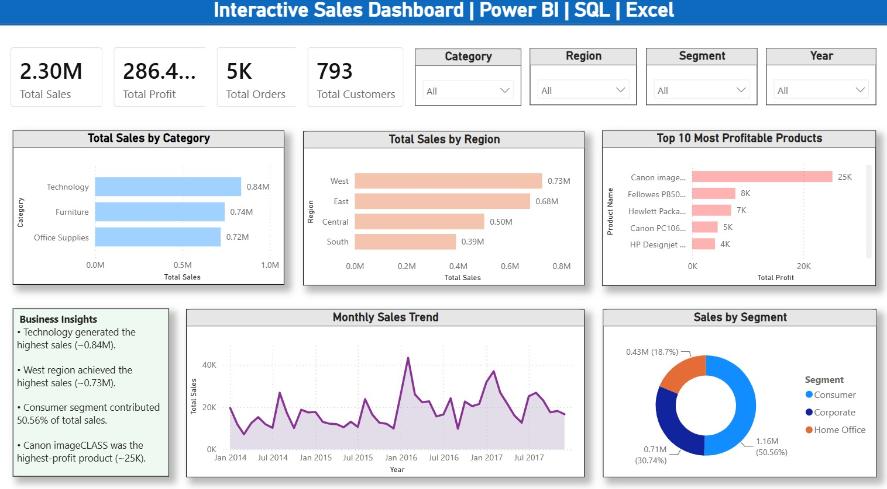

# Retail Sales Analytics Dashboard

This project analyzes the Superstore sales dataset using **SQL, Power BI, and Excel**. The goal was to understand sales performance, identify profitable products and regions, and build an interactive dashboard that helps answer common business questions.

## About the Project

I started by cleaning and exploring the dataset in Excel and MySQL. After performing SQL analysis, I built an interactive Power BI dashboard to visualize the key business metrics and trends.

This project helped me practice SQL querying, Power BI dashboard design, DAX measures, and data visualization.

## Tools Used

- Microsoft Excel
- MySQL
- Power BI Desktop

## Dashboard Highlights

The dashboard includes:

- Total Sales
- Total Profit
- Total Orders
- Total Customers
- Sales by Category
- Sales by Region
- Monthly Sales Trend
- Sales by Customer Segment
- Top 10 Most Profitable Products
- Interactive slicers for Category, Region, Segment, and Year

## SQL Analysis

I wrote 25+ SQL queries to analyze the dataset, covering topics such as:

- Aggregate Functions
- GROUP BY
- ORDER BY
- HAVING
- LIMIT
- DISTINCT
- Sales Analysis
- Profit Analysis
- Customer Analysis
- Product Analysis
- Regional Analysis
- Monthly Sales Analysis

## Key Insights

Some interesting observations from the analysis:

- Technology was the highest-selling category.
- The West region generated the highest sales.
- The Consumer segment contributed around 50% of total sales.
- Canon imageCLASS was the most profitable product.
- Sales showed noticeable peaks during 2016 and 2017.

## Dashboard Preview

## Project Files

Retail-Sales-Analytics-Dashboard/
│
├── Retail_Sales_Analytics.pbix
├── retail_sales_analysis.sql
├── Superstore ds.csv
├── DashBoard.jpeg
└── README.md

## What I Learned

Through this project, I gained hands-on experience with:

- Writing SQL queries for business analysis
- Creating DAX measures in Power BI
- Designing interactive dashboards
- Converting raw data into meaningful business insights

## Future Improvements

If I continue working on this project, I would like to add:

- Sales forecasting
- Customer segmentation analysis
- Profit margin analysis
- More interactive drill-through pages

## Author

**Rachit Shah**

Final Year B.Tech (Electronics & Communication Engineering)

Nirma University
